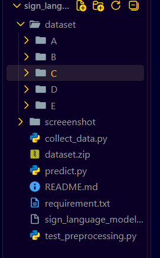
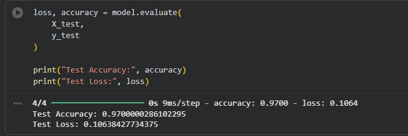
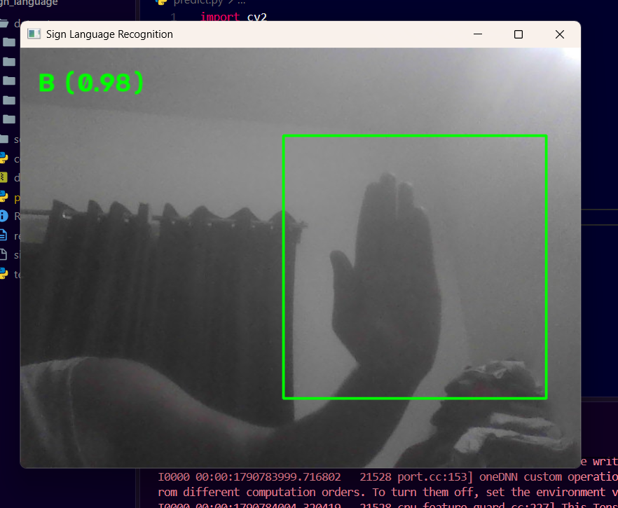

# 🤟 Sign Language Recognition using CNN

A real-time Sign Language Recognition system built using **Python, OpenCV, TensorFlow, and Convolutional Neural Networks (CNNs)**. The model recognizes hand signs from a webcam feed and predicts the corresponding alphabet.

---

## 📌 Project Overview

This project uses a Convolutional Neural Network (CNN) to classify hand gestures representing sign language alphabets. Images were collected using a custom dataset collection tool, preprocessed, and used to train a deep learning model. The trained model is then used for real-time predictions through a webcam.

---

## 🚀 Features

- Real-time hand sign recognition using webcam
- Custom dataset collection tool
- Image preprocessing and normalization
- CNN-based classification model
- Live prediction with confidence score
- Trained on custom hand sign dataset
- Easy to extend for all 26 alphabets

---

## 🛠️ Technologies Used

- Python
- OpenCV
- NumPy
- TensorFlow / Keras
- CNN (Convolutional Neural Network)
- Google Colab
- VS Code

---

## 📂 Project Structure

```text
sign-language-recognition/
│
├── screenshots/
│   ├── dataset_structure.png
│   ├── training_results.png
│   └── real_time_prediction.png
│
├── collect_data.py
├── test_preprocessing.py
├── predict.py
├── sign_language_model.keras
├── requirements.txt
├── README.md
└── .gitignore
```

---

## 📊 Dataset

Custom dataset created using a webcam.

Classes:

- A
- B
- C
- D
- E

Dataset Statistics:

| Class | Images |
|---------|---------|
| A | 100 |
| B | 100 |
| C | 100 |
| D | 100 |
| E | 100 |

**Total Images: 500**

---

## 🏗️ Model Training Workflow

1. Collected hand sign images using OpenCV and a webcam.
2. Organized images into class folders (A, B, C, D, E).
3. Compressed the dataset into a ZIP file and uploaded it to Google Colab.
4. Extracted and preprocessed the dataset.
5. Resized images to 64×64 pixels.
6. Normalized pixel values.
7. Performed train-test split.
8. Applied one-hot encoding to labels.
9. Trained a CNN model using TensorFlow/Keras.
10. Evaluated the model on unseen test data.
11. Saved the trained model as `sign_language_model.keras`.
12. Integrated the model with OpenCV for real-time webcam predictions.

---

## 🧠 Model Architecture

```text
Input Image (64x64x3)
        ↓
Conv2D (32 Filters)
        ↓
MaxPooling2D
        ↓
Conv2D (64 Filters)
        ↓
MaxPooling2D
        ↓
Flatten
        ↓
Dense (128)
        ↓
Output Layer (5 Classes)
```

---

## ⚙️ Training Details

- Image Size: 64 × 64
- Batch Size: 32
- Optimizer: Adam
- Loss Function: Categorical Crossentropy
- Epochs: 30
- Framework: TensorFlow/Keras

---

## 📈 Results

### Model Performance

- Test Accuracy: **97%**
- Test Loss: **0.106**

The model successfully recognizes hand signs for the trained classes in real time using a webcam.

---

## 📸 Project Screenshots

### Dataset Structure



### Training Results



### Real-Time Prediction



---

## 📦 Installation

Install all required dependencies:

```bash
pip install -r requirements.txt
```

---

## ▶️ How to Run

### Clone the Repository

```bash
git clone https://github.com/your-username/sign-language-recognition.git
cd sign-language-recognition
```

### Run Real-Time Prediction

```bash
python predict.py
```

Press:

```text
q
```

to quit the application.

---

## 🔄 Project Workflow

```text
Dataset Collection
        ↓
Image Preprocessing
        ↓
CNN Training
        ↓
Model Evaluation
        ↓
Model Saving
        ↓
Real-Time Prediction
```

---

## 🔮 Future Improvements

- Support all 26 alphabets (A–Z)
- Data augmentation
- Transfer learning using MobileNetV2
- Gesture-to-text conversion
- Word and sentence recognition
- Web deployment using Streamlit or Flask
- Mobile application integration

---

## 👨‍💻 Author

**Abhishek Yadav**

B.Tech – Computer Science & Engineering (AI & DS)

Machine Learning & Computer Vision Enthusiast

LinkedIn:
https://www.linkedin.com/in/abhishek-yadav-43199441a

---

## ⭐ Support

If you found this project useful, consider giving the repository a star on GitHub.